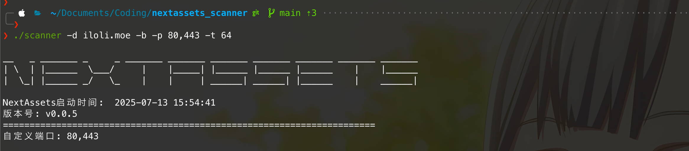
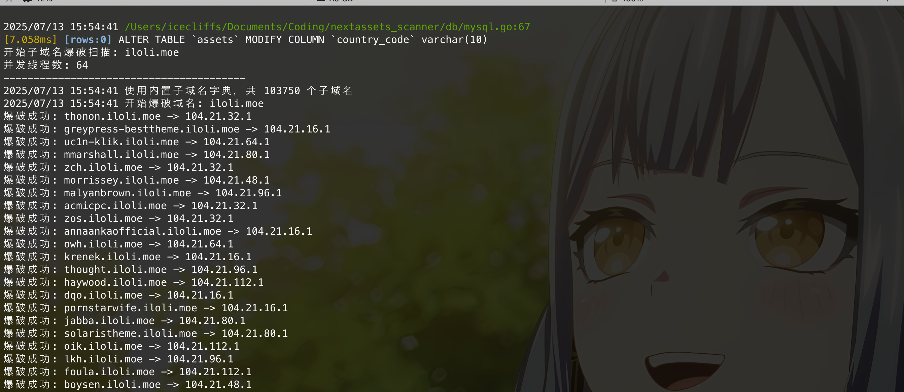
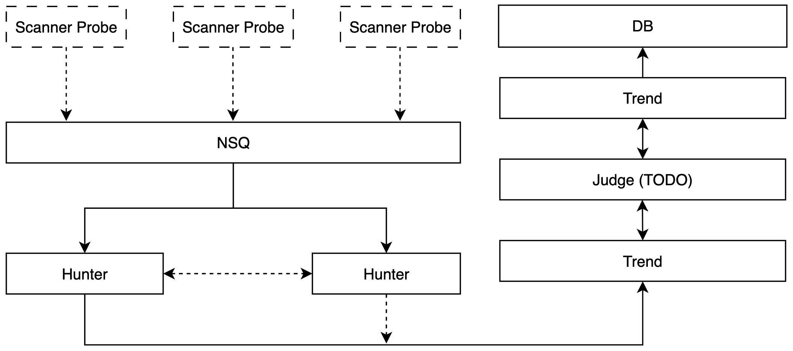
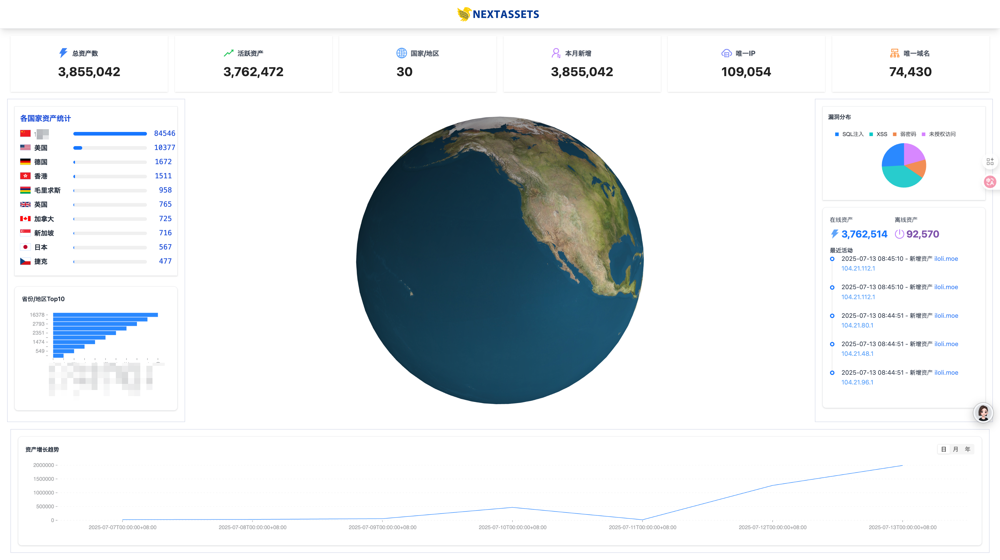
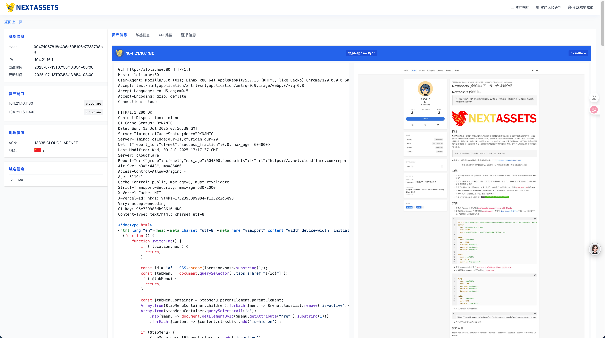
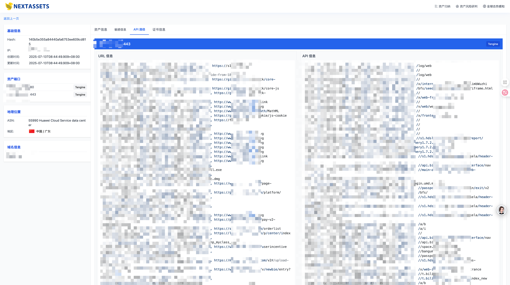
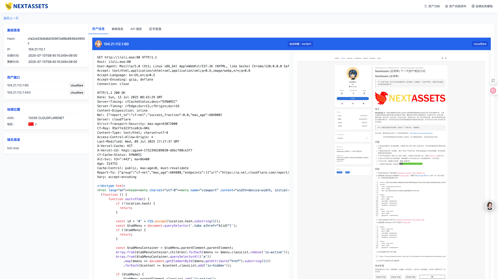
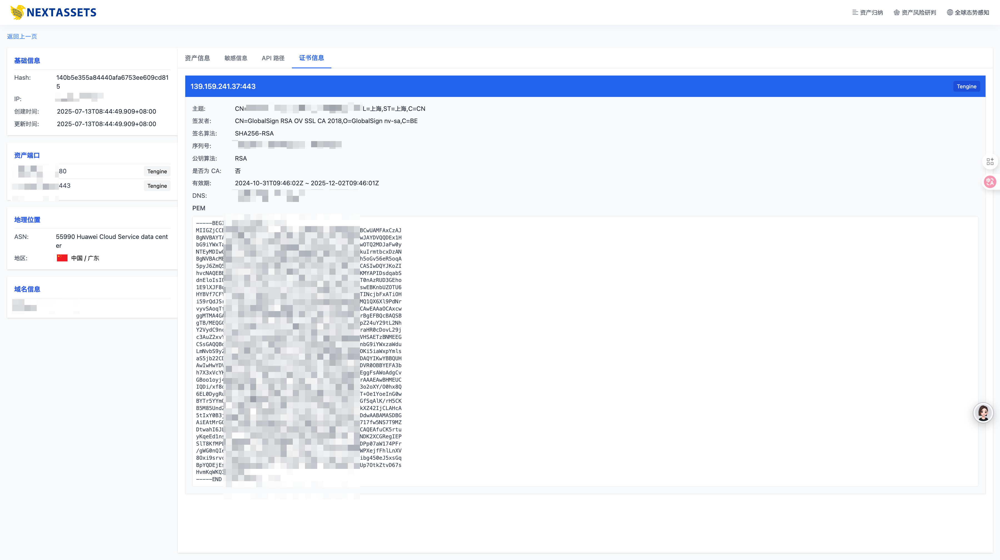
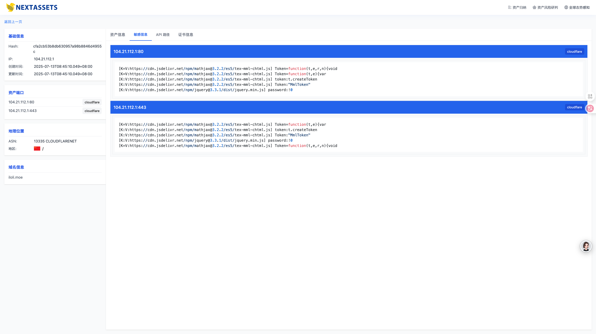

# NextAssets (Global Falcon)

> Next generation asset planning, committed to creating the worst attack surface mapping platform in the entire network, with the most bugs, the least functions, the least assets, and basically no scanning and attack surface

---

<div align="center">  
     
</div> 

[简体中文](./README.md)、[繁體中文](./README-zh-TW.md)、[English](./README-en-US.md)、[조선어](./README-ko-KP.md)

## Introduction

**NextAssets** It is an automated asset discovery and organization platform for cyberspace security practitioners and Internet intelligence gathering security. It supports multi-dimensional cyberspace mapping and collection and multi-dimensional asset management, covering basic information such as domain names/IP/ports, and supports HTTP/S, security scanning, vulnerability scanning, component identification, fingerprint identification, automated FUZZ, JS security analysis, SSL certificate analysis and other functions, which facilitates efficient cyberspace mapping and threat correlation analysis. This system will automatically clean and deduplicate the scanned data, and can automatically monitor the SRC project.

> PS: If you think the project looks familiar, you are right! Any coincidence is purely similar.

Before this, I wrote a very bad version in Python: http://github.com/icecliffs/Cliffscan

<div align="center">
<p>The technology used in this project is only for security personnel to use. If something goes wrong, the consequences are at your own risk. This project is only for learning and communication</p>
</div>

## Function

- [x] Website structure analysis and JS path extraction, multi-dimensional XSS scanning (headless real-time compilation of websites and capture of XSS endpoint information)

- [x] Data visualization support (expandable), port/protocol/middleware identification, use DeepSeek to analyze request data, and automatically extract sensitive information and risk information

- [x] Multi-dimensional asset identification (domain name/IP/component/fingerprint), multi-dimensional asset automatic association (such as: association with `bilibili.com` related IP)

- [x] SSL certificate association and certificate information extraction, website screenshots and HTTP response classification, syntax search function, distributed scanning, HOST collision and other technologies to discover hidden assets

- [x] IPv6 Support, scanner authentication mechanism, honeypot/honeynet identification, periodic scanning, SRC customized scanning, request/response analysis
- [ ] Global asset mapping progress (for entertainment) , since July 9, 2025

## Installation

1. The database service is best run in Docker. If the host has problems, I can't afford it. I only need to run Redis and MySQL
2. Then run the scanner `nextassets_scanner-v0.0.1-macos-arm64`
3. ~~ Then configure the `config.yaml` in the nextassets scanner. You need to go to [Next Assets Authorization Center](https://nextassets.iloli.moe) Perform one-machine-one-code authentication and authorization, and paste the authorization code into the configuration file~~. No authorization is required. I am too lazy to write it. Just scan it however you like. You only need to configure mysql.

4. Download the nextassets analysis platform `nextassets_platform-v0.0.1-macos-arm64`
5. Then configure the `config.yaml` in the nextassets analysis platform

```yaml
server:
host: 127.0.0.1
port: 8080

mysql:
host: 127.0.0.1
port: 3306
username: nextassets
password: 123456
database: nextassets

redis:
host: 127.0.0.1
port: 6379
password: "123456"
```

5. Start the scanner to scan the assets. It is best to download GeoLite2-City.mmdb and GeoLite2-ASN.mmdb to obtain ASN and geographic location (if scanning the entire network). You can check the specific parameters yourself. I don’t want to write them.

```
./nextassets_scanner-v0.0.1-macos-arm64 -t 64 -h 1.0.0.0/8,2.0.0.0/8 -p 198,2003
```



6. View the corresponding scan results on the analysis platform (because the author scans the entire network on the analysis platform, the cache time is set to 12 hours🧐. It is recommended to use syntax to search the network segment you scanned in the early stage `ip="192.168.50.0/24"`) **The analysis platform will automatically initialize the database. It is recommended to set the database name to nextassets**, and then the query will also be cached, which will be refreshed every 12 minutes, so it is recommended to wait until the scan is completed before querying. . .

```
./nextassets_platform-v0.0.1-macos-arm64
```



7. Finally, go to the analysis platform to see what you have scanned, enjoy :)

## Technical implementation

Currently, it is mainly divided into three ends, namely the probe (scanner, initially completed), the analysis platform (situation sorting, completed) and the judgment platform (basically implemented, can perform security analysis on all assets, and introduce fscan for security risk detection)



The probe end only needs to be responsible for scanning, while the trend and hunter ends need to consider a lot of things, the probe It is only responsible for collecting asset information and then pushing it to the analysis platform, while the analysis platform will analyze the probe data, classify assets, and visualize the results

The scanner runs independently and can be distributed on different machines. You only need to ensure that the database and platform message queue configuration are correct

My scanning party: Amazon, Vultr and other VPS each have 3 machines, and the nodes are Japan, Hong Kong, the United States, Singapore, and Taiwan, and then initiate a scan, and finally return the data to a certain server

## Syntax description

There is a search box on the homepage, you can enter the corresponding syntax to search for assets

> Search


- Specific syntax

```bash
ip query asset IP ip="116.62.191.10"
ip.port port (context.ports) supports IN, =, !=
domain domain name domain="iloli.moe"
hash asset hash hash="c4ca4238a0b923820dcc509a6f75849b"
country country="cn"
province province="Fujian"
create_time creation time create_time>="1989-01-01"
update_time update time update_time>="1989-01-01"
```

## Data display

> Situation screen



> Data display



> Sensitive information identification



> Site screenshot



> Asset summary



> Risk path identification



I won’t upload the image. It’s tiring to type it.

## Paper reference

> Thanks to all the experts for providing the papers. After reading them, I found that I didn’t understand anything, but I still wrote them anyway, so there are many bugs.

- CHEN Qing, LI Han, DU Yuejin, ZHANG Yirong, . Practice and thinking of cyberspace surveying and mapping technology[J]. Information and Communications Technology and Policy, 2021, 47(8): 30-38.
- ZHOU Yang, XU Qing, LUO Xiangyang, LIU Fenlin, ZHANG Long, HU Xiaofei. Research on the concept and technical system of cyberspace surveying and mapping[J]. Computer Science, 2018, 45(5):1-7.
- Wang Chendong, Guo Yuanbo, Zhen Shuaihui, Yang Weichao. Research on network asset detection technology[J]. Computer Science, 2018, 45(12):24-31.
- Green Alliance Technology "Cyberspace Mapping Theory System White Paper" https://www.shujiaowang.cn/uploads/20230702/db8df40f3c9a663ddd9ff1e203489940.pdf
- [ A Review of Global Cyberspace Mapping Research](https://jcs.iie.ac.cn/ch/reader/view_reference.aspx?pcid=5B3AB970F71A803DEACDC0559115BFCF0A068CD97DD29835&cid=8240383F08CE46C8B05036380D75B607&jid=09F0A586465 924BAA255CE91FDD7C7DF&aid=E21E6737789C2A772C2343BD4521F616&yid=B6351343F4791CA3&vid=2B25C5E62F83A049&iid=94C357A881DFC066&sid=CA4FD0336C81A37A&eid=B31275AF3241DB2D)[J]. Microcomputer and Application