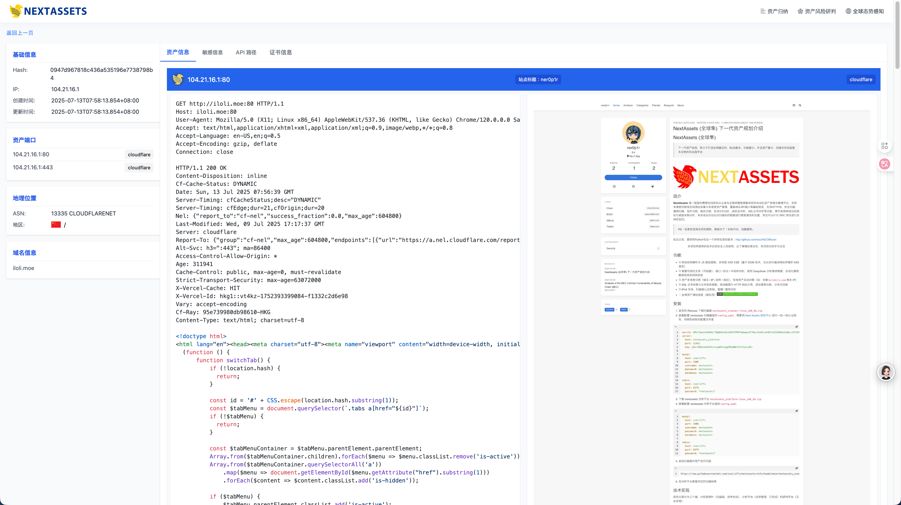
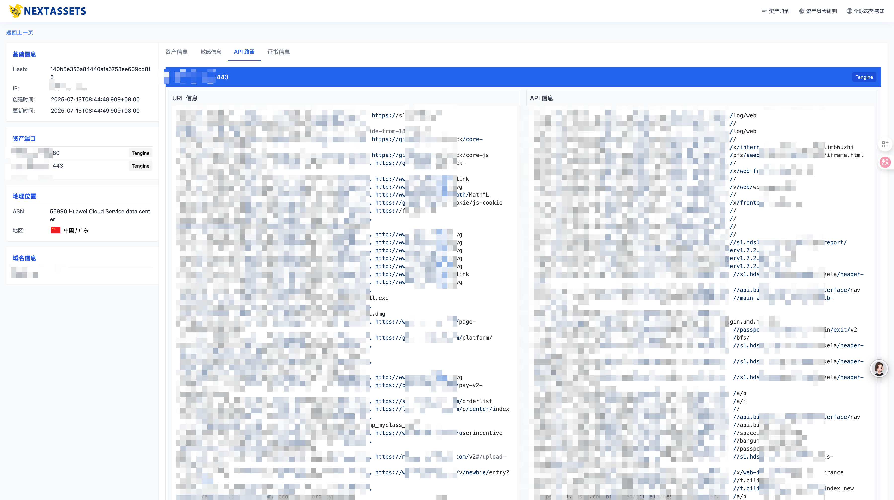

# NextAssets (全球隼)

> 下一代资产规划，致力于打造全网最烂的、BUG最多、功能最少、并且资产最少、扫描与攻击面基本没有的攻击面测绘平台

---

<div align="center">  
     
</div> 

- [简体中文](README.md)
- [繁體中文](README-zh-TW.md)
- [English](README-en-US.md)
- [조선어](README-ko-KP.md)

## 简介

**NextAssets** 是一款面向赛博空间保安从业者与互联网情报搜集保安的自动化资产发现与整理平台，支持多维度的网络空间测绘采集与多维度资产管理，覆盖域名/IP/端口等基础信息，支持HTTP/S、安全扫描、漏洞扫描、组件识别、指纹识别、自动化FUZZ、JS安全分析、SSL证书分析等功能，便于高效网络空间测绘与威胁关联分析，本系统会自动化对扫描到的数据进行数据清洗和去重，并且可以针对 SRC 项目进行自动化监控。

> PS：如果您觉得该项目眼熟，那就对了！如有巧合，纯属雷同。

在此之前，曾使用Python写过一个非常垃圾的版本：http://github.com/icecliffs/Cliffscan

<div align="center">
<p>本项目所使用的技术仅供安全人员使用，出了事情后果自负，本项目仅供学习交流</p>
</div>

## 功能

- [x] 网站结构解析与 JS 路径提取、多维度 XSS 扫描（无头实时编译网站并捕获 XSS 端点信息）
- [x] 数据可视化支持（可拓展）、端口 / 协议 / 中间件识别，使用 DeepSeek 分析请求数据，自动化提取敏感信息和风险信息
- [x] 资产多维度识别（域名 / IP / 组件 / 指纹）、多维资产自动关联（如：关联 `bilibili.com` 相关 IP）
- [x] SSL 证书关联与证书信息提取、网站截图与 HTTP 响应分类、语法搜索功能、分布式扫描、HOST碰撞等技术发现隐藏资产
- [x] IPv6 支持、扫描器认证机制、蜜罐 / 蜜网识别、周期扫描、SRC 定制扫描、请求/响应分析
- [ ] 全球资产测绘进度（娱乐用），自2025年7月9日以来

> 资产轮询使用方法，先用命令行吧，比自带的好使（

```bash
# /etc/crontab
0 3 * * 1 /tools/scanner -d blog.iloli.moe,iloli.moe --brute -t 64 -g "iloli站点"
```

兄弟们，资产太多了后端查询炸了，重新写查询中


## 安装

1. 数据库服务最好跑在 Docker 里，如果宿主出了问题我担负不起，只需要跑 Redis 和 MySQL 即可
2. 然后运行扫描器  `nextassets_scanner-v0.0.1-macos-arm64`
3. ~~接着配置 nextassets 扫描器里的 `config.yaml`，需要到 [Next Assets 授权中心](https://nextassets.iloli.moe) 进行一机一码认证授权，将授权码贴到配置文件里~~，不需要授权了，我懒得写，爱咋扫咋扫吧，只需要配置mysql就行

3. 下载 nextassets 分析平台 `nextassets_platform-v0.0.1-macos-arm64`
4. 接着配置 nextassets 分析平台里的 `config.yaml`

```yaml
server:
  host: 127.0.0.1
  port: 8080

mysql:
  host: 127.0.0.1
  port: 3306
  username: nextassets
  password: 123456
  database: nextassets

redis:
  host: 127.0.0.1
  port: 6379
  password: "123456"
```

5. 启动扫描器对资产进行扫描，扫描器最好下载 GeoLite2-City.mmdb 和 GeoLite2-ASN.mmdb 来获取 ASN 和地理位置（如果扫全网的话），具体参数自己看吧，不想写了

```
./nextassets_scanner-v0.0.1-macos-arm64 -t 64 -h 1.0.0.0/8,2.0.0.0/8 -p 198,2003
```


6. 在分析平台查看对应的扫描结果（分析平台因为作者自己扫的全网，所以缓存时间设置为12小时🧐，建议前期使用语法搜索你扫描的网段 `ip="192.168.50.0/24"`）**分析平台汇会自动初始化数据库，建议设置数据库名为 nextassets**，然后查询也有缓存，具体12分钟刷新一次，所以还是建议等扫描完后在查询。。。

```
./nextassets_platform-v0.0.1-macos-arm64
```


7. 最后到分析平台看看你扫了什么东西吧，enjoy :)

## 技术实现

目前主要分为三个端，分别是探针（扫描器，初步完成）、分析平台（态势整理，已完成）和研判平台（已基本实现，能对所有资产进行安全分析，引入 fscan 进行安全风险检测）


probe 端只需要负责扫描即可，而 trend 和 hunter 端需要考虑的东西可多了，probe 只负责采集资产信息然后推送到分析平台，而分析平台会对探针数据，做资产归类等分析，并且将结果可视化识别

扫描器独立运行，可分布在不同的机子上面，只需要保证数据库和平台消息队列配置没有出错即可

我的扫描方：亚马逊、Vultr 等 VPS 各有 3 台机子，节点分别为日本、香港、美国、新加坡、台湾，然后发起扫描，最后返回数据到某台服务器上

## 语法说明

首页有搜索框，可以输入相对应的语法进行资产搜索

> 搜索


- 具体语法

```bash
ip	查询资产IP	ip="116.62.191.10"
ip.port	端口 (context.ports)	支持 IN、=、!=
domain	域名	domain="iloli.moe"
hash	资产hash	hash="c4ca4238a0b923820dcc509a6f75849b"
country	国家	country="cn"
province	省份	province="福建"
create_time	创建时间	create_time>="1989-01-01"
update_time	更新时间	update_time>="1989-01-01"
```

## 数据展示

> 态势大屏


> 数据展示




> 敏感信息识别



> 站点截图


> 资产归纳整理


> 风险路径识别


图不传了，打码好累的说

## 论文参考

> 感谢各位专家提供的论文，本人在阅读完后发现什么都不懂，但还是硬着头皮写了出来，所以才会有很多bug

- CHEN Qing, LI Han, DU Yuejin, ZHANG Yirong, . Practice and thinking of cyberspace surveying and mapping technology[J]. Information and Communications Technology and Policy, 2021, 47(8): 30-38.
- 周杨,徐青,罗向阳,刘粉林,张龙,胡校飞.网络空间测绘的概念及其技术体系的研究[J].计算机科学,2018,45(5):1-7.
- 王宸东,郭渊博,甄帅辉,杨威超.网络资产探测技术研究[J].计算机科学,2018,45(12):24-31.
- 绿盟科技《网络空间地图测绘理论体系白皮书》https://www.shujiaowang.cn/uploads/20230702/db8df40f3c9a663ddd9ff1e203489940.pdf
- [ 全球网络空间测绘地图研究综述](https://jcs.iie.ac.cn/ch/reader/view_reference.aspx?pcid=5B3AB970F71A803DEACDC0559115BFCF0A068CD97DD29835&cid=8240383F08CE46C8B05036380D75B607&jid=09F0A586465924BAA255CE91FDD7C7DF&aid=E21E6737789C2A772C2343BD4521F616&yid=B6351343F4791CA3&vid=2B25C5E62F83A049&iid=94C357A881DFC066&sid=CA4FD0336C81A37A&eid=B31275AF3241DB2D)[J].微型机与应用
