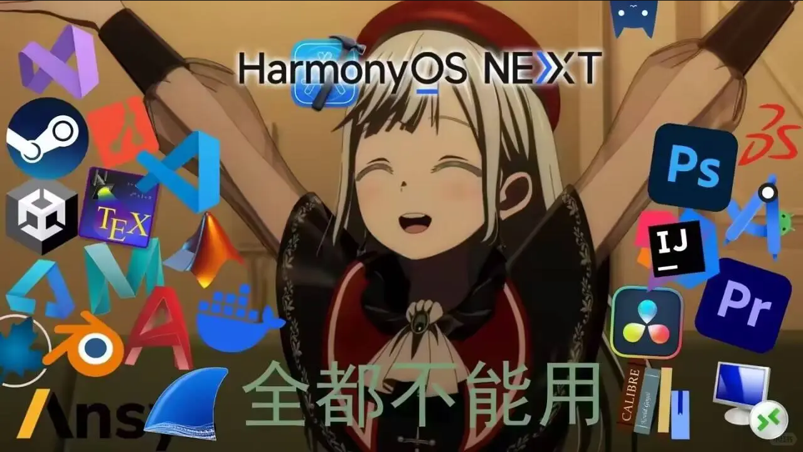
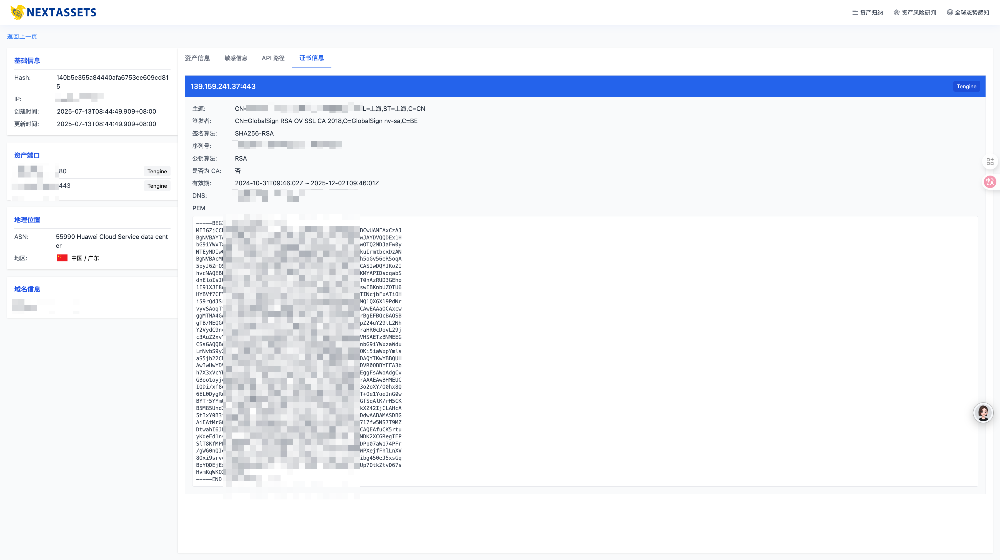
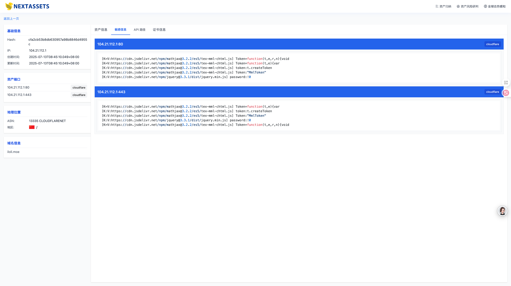

# NextAssets

> Dedicated to becoming the worst attack surface mapping platform on the entire internet — with the most bugs, the fewest features, almost no assets, and barely any scanning or attack-surface capability at all.

---

<div align="center">  
     
</div> 

- [简体中文](README.md)
- [繁體中文](README-zh-TW.md)
- [English](README-en-US.md)
- [조선어](README-ko-KP.md)

## Introduction

NextAssets is an automated asset discovery and management platform designed for cybersecurity practitioners and internet intelligence analysts. It supports multidimensional cyberspace mapping and asset management, covering core information such as domains, IPs, and ports.
The platform provides functionalities including HTTP/HTTPS scanning, security scanning, vulnerability scanning, component and fingerprint identification, automated fuzzing, JavaScript security analysis, SSL certificate analysis, and more — enabling efficient cyberspace mapping and threat correlation analysis.

The system automatically performs data cleaning and deduplication on collected scan results and also supports automated monitoring for SRC (Security Response Center) programs.

> PS: If this project looks familiar to you, that’s right! Any resemblance is purely coincidental.

Previously, I wrote a very trashy version of this in Python: http://github.com/icecliffs/Cliffscan

## Features

- [X] Think of the common vulnerability scanners from major security vendors — it’s basically the same, just without a PoC library 🫠
- [ ]Global asset mapping progress (for entertainment):  since July 9, 2025

> Usage of asset polling — start with the command-line version; it works better than the built‑in one

```bash
# /etc/crontab
0 3 * * 1 /tools/scanner -d blog.iloli.moe,iloli.moe --brute -t 64 -g "iloli站点"
```

Guys, there are too many assets and the backend queries have crashed. Rewriting the query logic now



## Installation

1. It’s recommended to run the database services in Docker. I’m not responsible if something goes wrong on the host. You only need Redis and MySQL.
2. Then run the scanner: `nextassets_scanner-v0.0.1-macos-arm64`
4. Next, configure config.yaml in the NextAssets scanner. You used to need to authenticate via the Next Assets Authorization Center with a machine-specific code, then paste the license into the config file. No authorization is needed anymore — just configure MySQL and start scanning.
3. Download the NextAssets analysis platform: `nextassets_platform-v0.0.1-macos-arm64`
4. Then configure `config.yaml` in the NextAssets analysis platform.

```yaml
server:
  host: 127.0.0.1
  port: 8080

mysql:
  host: 127.0.0.1
  port: 3306
  username: nextassets
  password: 123456
  database: nextassets

redis:
  host: 127.0.0.1
  port: 6379
  password: "123456"
```

5. Start the scanner to scan assets. It’s recommended to download GeoLite2-City.mmdb and GeoLite2-ASN.mmdb to obtain ASN and geolocation information (especially if scanning the entire internet). Check the parameters yourself — I’m too lazy to write them.

```
./nextassets_scanner-v0.0.1-macos-arm64 -t 64 -h 1.0.0.0/8,2.0.0.0/8 -p 198,2003
```


6. View the corresponding scan results on the analysis platform. (Since the author scanned the entire internet, the platform cache is set to 12 hours 🧐. It’s recommended to use syntax search for your scanned subnet early on, e.g., ip="192.168.50.0/24".), The analysis platform will automatically initialize the database — it’s recommended to name it nextassets. Queries are also cached and refresh every 12 minutes, so it’s better to wait until the scan is complete before running queries.

```
./nextassets_platform-v0.0.1-macos-arm64
```


7. Finally, check out what you’ve scanned on the analysis platform. Enjoy :)

## Technical Implementation

Currently, the system is mainly divided into three components: the Probe (scanner, initially completed), the Analysis Platform (situation aggregation, completed), and the Assessment Platform (basically implemented, capable of performing security analysis on all assets and integrating fscan for security risk detection).


The probe only needs to handle scanning, while the trend and hunter components have much more to consider. The probe is responsible solely for collecting asset information and pushing it to the analysis platform. The analysis platform then categorizes the probe data, performs further analysis, and visualizes the results.

The scanner runs independently and can be distributed across different machines, as long as the database and platform message queue configurations are correct.

My scanning setup: three VPS machines each from providers like Amazon and Vultr, with nodes located in Japan, Hong Kong, the US, Singapore, and Taiwan. Scans are initiated from these nodes, and the data is ultimately returned to a single server.

## Syntax Guide

The homepage has a search box where you can enter the corresponding syntax to search for assets.

> Search


- Syntax Details

```bash
ip	查询资产IP	ip="116.62.191.10"
ip.port	端口 (context.ports)	支持 IN、=、!=
domain	域名	domain="iloli.moe"
hash	资产hash	hash="c4ca4238a0b923820dcc509a6f75849b"
country	国家	country="cn"
province	省份	province="福建"
create_time	创建时间	create_time>="1989-01-01"
update_time	更新时间	update_time>="1989-01-01"
```

## 数据展示

> 态势大屏


> 数据展示


> 敏感信息识别


> 站点截图


> 资产归纳整理



> 风险路径识别



图不传了，打码好累的说

## 论文参考

> 感谢各位专家提供的论文，本人在阅读完后发现什么都不懂，但还是硬着头皮写了出来，所以才会有很多bug

- CHEN Qing, LI Han, DU Yuejin, ZHANG Yirong, . Practice and thinking of cyberspace surveying and mapping technology[J]. Information and Communications Technology and Policy, 2021, 47(8): 30-38.
- 周杨,徐青,罗向阳,刘粉林,张龙,胡校飞.网络空间测绘的概念及其技术体系的研究[J].计算机科学,2018,45(5):1-7.
- 王宸东,郭渊博,甄帅辉,杨威超.网络资产探测技术研究[J].计算机科学,2018,45(12):24-31.
- 绿盟科技《网络空间地图测绘理论体系白皮书》https://www.shujiaowang.cn/uploads/20230702/db8df40f3c9a663ddd9ff1e203489940.pdf
- [ 全球网络空间测绘地图研究综述](https://jcs.iie.ac.cn/ch/reader/view_reference.aspx?pcid=5B3AB970F71A803DEACDC0559115BFCF0A068CD97DD29835&cid=8240383F08CE46C8B05036380D75B607&jid=09F0A586465924BAA255CE91FDD7C7DF&aid=E21E6737789C2A772C2343BD4521F616&yid=B6351343F4791CA3&vid=2B25C5E62F83A049&iid=94C357A881DFC066&sid=CA4FD0336C81A37A&eid=B31275AF3241DB2D)[J].微型机与应用

## 法律 && 免责声明

如果您下载、安装、使用、修改本工具及相关代码，即表明您信任本工具，在使用本工具时造成对您自己或他人任何形式的损失和伤害，我们不承担任何责任，如您在使用本工具的过程中存在任何非法行为，您需自行承担相应后果，我们将不承担任何法律及连带责任，请您务必审慎阅读、充分理解各条款内容，特别是免除或者限制责任的条款，并选择接受或不接受，除非您已阅读并接受本协议所有条款，否则您无权下载、安装或使用本工具，您的下载、安装、使用等行为即视为您已阅读并同意上述协议的约束，非引战，非水军，非反串，仅为个人感想，合法合宪，无任何衍生含义内容，不代表任何其他团体、个人，无任何隐喻，暗示，反串，碰瓷，蹭热度等想法。本人家庭和睦安康、无任何心理或精神疾病，智力正常完整接受了九年义务教育。本人观点及言论仅代表我个人一点浅薄的看法，非专业学术内容仅为个人理解，部分内容仅为猜测，不代表实际情况，与本人所在群体、父母亲朋、所在国家、省、市、地区无关，如有不同观点欢迎礼貌讨论、指正。本言论不含有对任何群体的歧视，不含有任何挑起对立的含义。本人认知范围浅薄，无专业团队，内容偏个人想法，如有误会歧义欢迎指正。如有疑惑欢迎私信质疑，本人会尽量——回复，未回复也可能是手滑没看到。本人使用字体为免费开源字体，无任何恶意侵权行为，评论中如果引用、化用了他人观点我会尽量表明出处，如有侵权请证明关联性，本人会尽快处理。本人的表达能力一般，如果文字过于欠揍绝非恶意鄙视某个人、团体、组织、群体。评论区其他网友的意见不代表本人想法，不代表本人意思，如有点赞到您不认可的内容纯属手滑，绝非故意针对你个人或你所在群体、团体、组织。本人神经天马行空，常常脱离常识，如有歧义欢迎指正。本人为地球人，热爱地球文化文明，严格遵守所在地区的法律法规，绝无任何反人类倾向，本人承诺未向三体发送过地球坐标，未向任何外星人、异次元文明、平行宇宙、其它宇宙、平行宇宙透露过地球信息。本人个人性别为男性，尊重男性、女性和其他性少数群体，坚定支持男女平等，男女两字的排序不分前后。尊重人权，不种族歧视，不地域黑。本人用词较为偏向网络口语，绝无任何恶意，绝无任何将严肃话题娱乐话的意图。本人承诺热爱动物、植物、对人体和自然环境有益的、无害的微生物，如若把人比喻成某种动物、植物或微生物仅为通俗调侃，绝无任何践踏人类人格、尊严、人权等意图，也绝无歧视该动物、植物、微生物的意图。本人素质为平均素质，发表言论不具备任何专业性，仅供参考。本人对自己发表内容会负所有责任。如看不惯可以拉黑处理。
。
